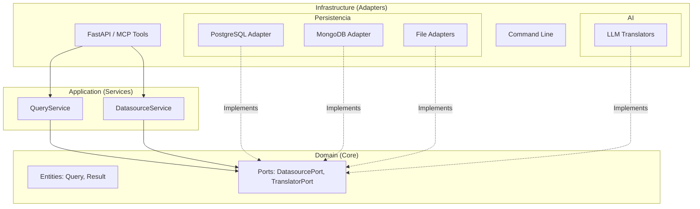
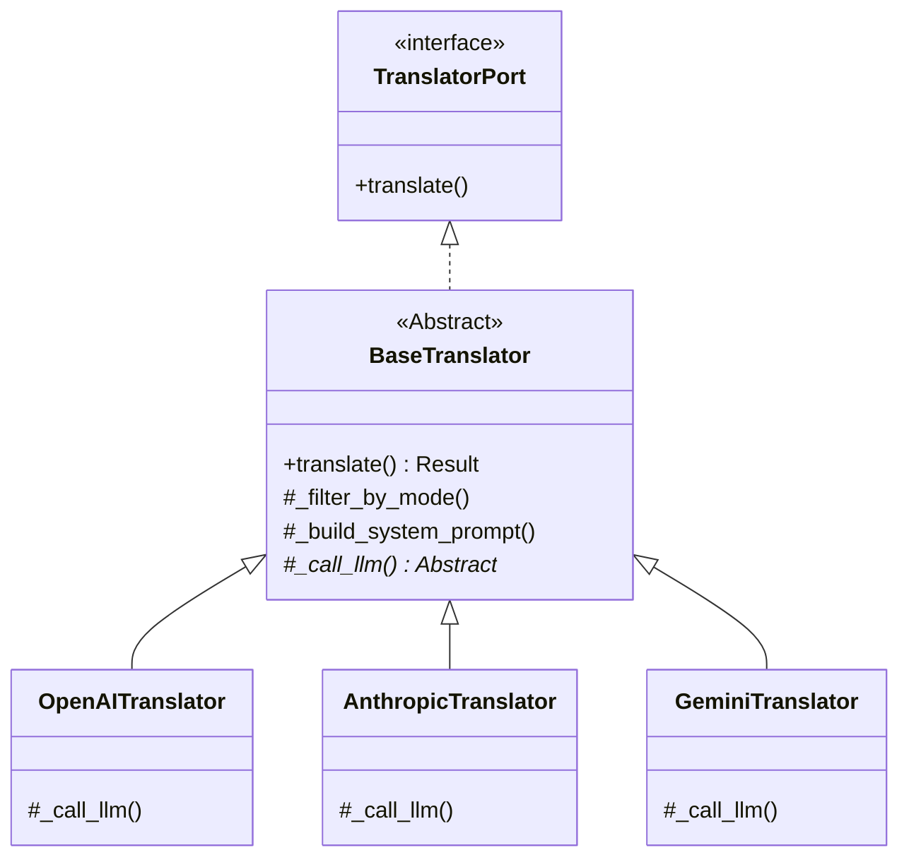
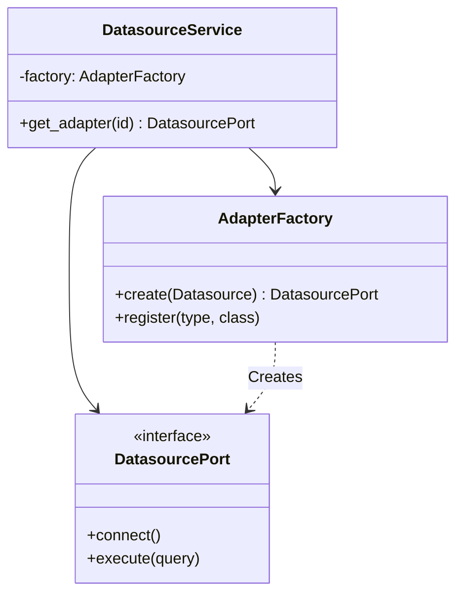
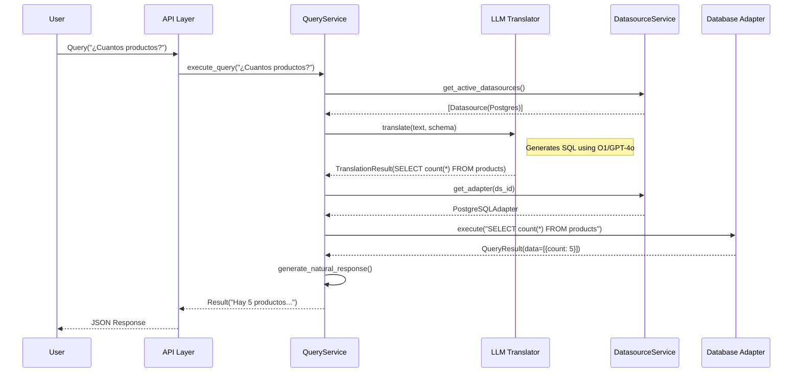

# Arquitectura del Sistema: MCP Text-to-SQL

Este documento detalla la arquitectura, decisiones de diseño y flujos de datos del sistema **MCP Text-to-SQL**.

## 1. Visión General de Arquitectura

El proyecto sigue una **Arquitectura Hexagonal (Ports & Adapters)** estricta para garantizar:
- **Desacoplamiento**: La lógica de negocio (Dominio/Aplicación) no depende de frameworks externos.
- **Testabilidad**: Componentes fáciles de mockear y probar aisladamente.
- **Extensibilidad**: Fácil adición de nuevos motores de base de datos o proveedores LLM sin tocar el núcleo.

---

## 2. Patrones de Diseño Clave

### A. Template Method (LLM Translation)
Utilizado en el módulo de traducción para evitar duplicación de código (DRY) y mantener consistencia.

- **`BaseTranslator`**: Clase abstracta que define el esqueleto del algoritmo de traducción (`translate`). Implementa la lógica común (prompting, filtrado de contexto, parsing de JSON).
- **Subclases (`OpenAITranslator`, etc.)**: Solo implementan los métodos abstractos específicos del proveedor (`_call_llm`, `explain_query`).

### B. Dependency Inversion & Factory (Datasources)
El `DatasourceService` no conoce las clases concretas de los adaptadores (e.g., `PostgreSQLAdapter`). Usa una `AdapterFactory` inyectada para crear instancias que cumplen con el protocolo `DatasourcePort`.

---

## 3. Flujo de Ejecución: "Text-to-SQL"

Diagrama de secuencia que muestra cómo una consulta en lenguaje natural se transforma en datos.

1. **Usuario** envía query ("¿Cuantos productos hay?").
2. **QueryService** obtiene datasources activos del **DatasourceService**.
3. **QueryService** llama al **Translator** (LLM) con el esquema de la BD.
4. **Translator** genera SQL (o query nativo).
5. **QueryService** obtiene el **Adapter** correspondiente.
6. **Adapter** ejecuta la consulta en la BD real.
7. **Result** se devuelve y opcionalmente se enriquece con una respuesta natural.

## 4. Estructura de Componentes

### Capa de Dominio (`src/domain`)
Define las reglas de negocio y contratos (interfaces).
- **`entities/`**: Objetos puros como `Query`, `QueryResult`, `Datasource`.
- **`ports/`**: Interfaces que debe implementar la infraestructura.

### Capa de Aplicación (`src/application`)
Orquesta los casos de uso.
- **`QueryService`**: Coordina la traducción y ejecución.
- **`DatasourceService`**: Gestiona el ciclo de vida de conexiones.

### Capa de Infraestructura (`src/infrastructure`)
Detalles técnicos externos.
- **`adapters/sql`**: Implementaciones SQLAlchemy para Postgres, MySQL, etc.
- **`adapters/nosql`**: Implementaciones PyMongo.
- **`llm/`**: Integraciones con APIs de IA.
- **`config/`**: Manejo de variables de entorno (Pydantic Settings).

### Capa de API (`src/api`)
Punto de entrada.
- **`mcp_tools`**: Endpoints compatibles con Model Context Protocol.
